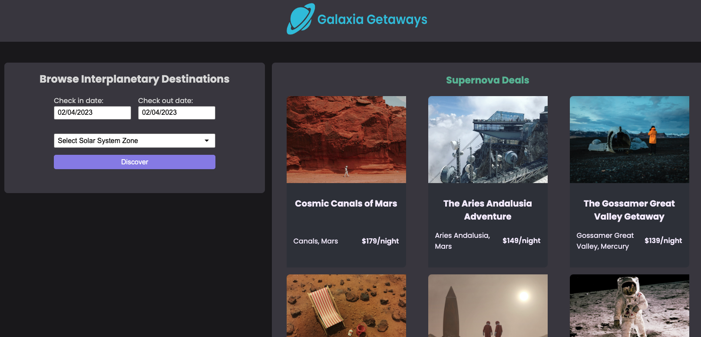
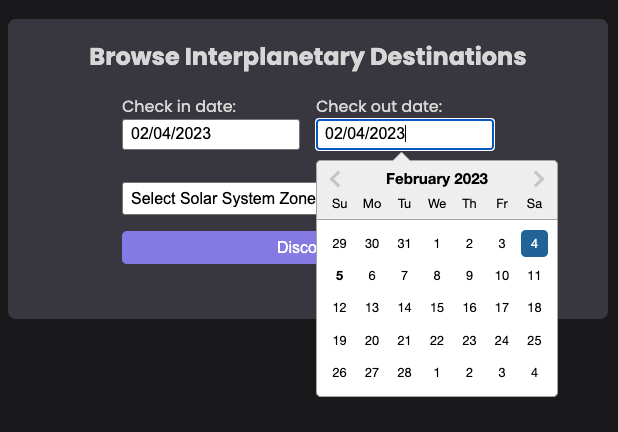
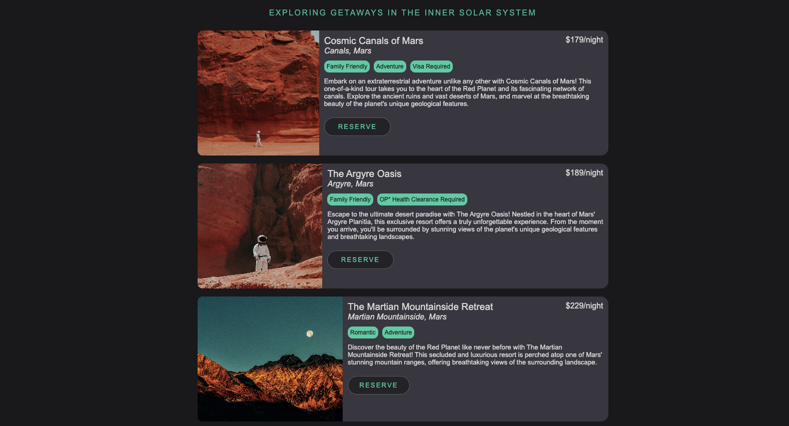
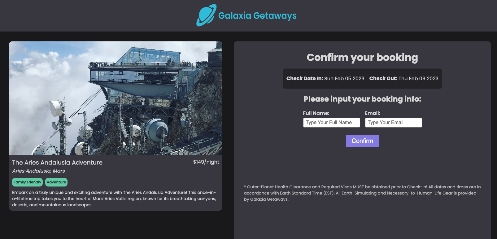

# Galaxia Getaways
### A hackathon project for [Hack for the Future](https://hack-for-the-future.devpost.com/) Feb.3rd-5th 2023!

## Hackathon Team:
- [Marguerite Andreca](https://github.com/margueriteandreca) - Full-Stack Software Engineer
- [Tyrell Curry](https://github.com/tyrellcurry) - Frontend Developer

## Table of contents

- [Overview](#overview)
  - [The Hackathon challenge](#the-hackathon-challenge)
  - [Screenshots](#screenshots)
- [Our process](#our-process)
  - [Built with](#built-with)
  - [What we learned](#what-we-learned)
  - [Continued development](#continued-development)
  - [Useful resources](#useful-resources)

## Overview

### The Hackathon Challenge

We're traveling to the year 2150 and building a hack from the future! The hackathon started the evening of Feb.3rd 2023 and ended the morning of Feb.5th 2023. The project was started, completed, and submitted within that timeframe.

### Screenshots
#### Homepage

#### Date Selection

#### Discovery Results

#### Booking Checkout

#### Booking Confirmation

## Our Process

### Built with

- NextJS
- CSS3
- HTML5
- Local JSON Database
- Local Browser Storage
- [react-datepicker](https://www.npmjs.com/package/react-datepicker)

### What we learned

- This was each our first Hackathon! We learned how to quickly brainstorm, divide the work, and hit the ground running to hit a super short deadline!
- Quick collaboration on Github for code efficiency 
- Some fun space facts in the process of building the app

### Continued development

 - We would like to explore more advanced CSS styling on our components and pages, as well as adding additional features such as an interactive travel agent chatbot.

### Useful resources

- [Major League Hacking](https://mlh.io/)
- [Upcoming Hackathons](https://mlh.io/seasons/2023/events)
- [MLH Twitch](https://www.twitch.tv/mlh)